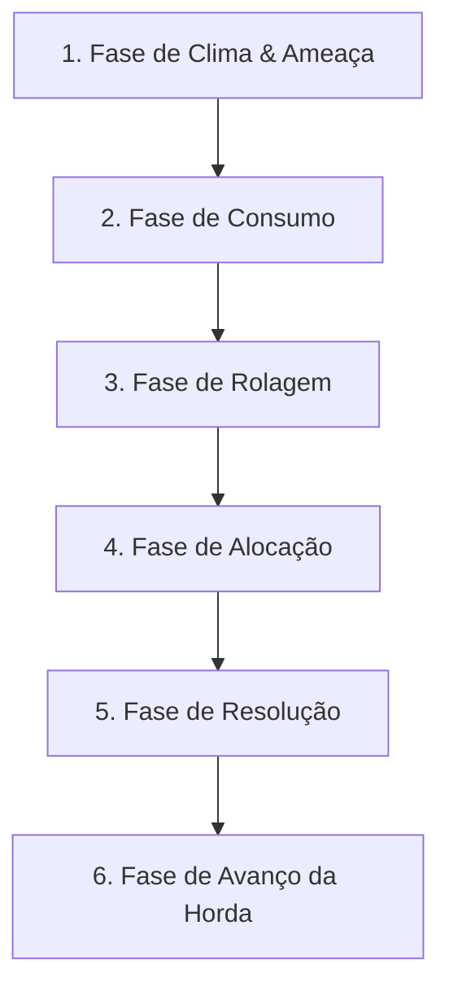

# Game Design Document (GDD) & Manual de Regras
## 12 Dias: Rota de Fuga

*Um jogo Print and Play (PnP) de alocação de dados e sobrevivência solo.*

---

## 1. Visão Geral e História
Você se encontra preso no coração de uma metrópole em ruínas, cercada por uma horda interminável de mortos-vivos. Sua única esperança de fuga é um carro antigo abandonado em uma oficina mecânica. Você precisa vasculhar os arredores da cidade para coletar peças e suprimentos enquanto fortifica sua posição. Cada dia que passa, a horda se aproxima mais.

*   **Objetivo de Vitória**: Reparar completamente o carro (alcançar o nível 6 de conserto) e escapar da cidade.
*   **Condições de Derrota**:
    1.  Sua **Vida** chegar a 0.
    2.  Sua **Infecção** chegar a 6 (você se transforma).
    3.  A **Horda** alcançar a oficina (trilha da Horda chegar ao limite).

---

## 2. Componentes Necessários
Para jogar *12 Dias: Rota de Fuga*, você precisará de:
*   **1 Folha de Jogo** impressa (tamanho A4).
*   **5 Dados D6 comuns** (dados de seis lados).
*   **1 Dado D6 extra** de cor diferente (para rolar encontros e clima).
*   **1 Lápis e Borracha** (ou cubos físicos/marcadores para colocar sobre as trilhas de recursos).

---

## 3. Os 4 Medidores de Status (Tensão)
Durante o jogo, você deve gerenciar os seguintes medidores marcando-os na folha com o lápis ou com marcadores físicos:

| Medidor | Faixa de Valores | Efeito ao Limite |
| :--- | :--- | :--- |
| **Vida** | 0 a 6 | Se chegar a 0, você morre (Derrota). |
| **Infecção** | 0 a 6 | Se chegar a 6, você se transforma (Derrota). |
| **Suprimentos** | 0 a 8 | Consome 1 por rodada. Se estiver em 0 no início do turno, você perde 1 Vida. |
| **Trilha da Horda** | Varia (conforme dificuldade) | Se a horda chegar ao final, seu abrigo é invadido (Derrota). |

### Recursos de Inventário
*   **Sucata (0 a 6):** Peças de metal usadas para consertar o carro ou fabricar itens.
*   **Munição (0 a 6):** Gastar 1 Munição adiciona +1 ao valor total da Defesa ou combate na rodada atual.
*   **Kit Médico (0 a 6):** Gastar 1 Kit Médico recupera 2 de Vida ou reduz 2 de Infecção.

---

## 4. O Fluxo do Turno (Loop de Jogo)
Cada turno representa 1 Dia de sobrevivência e é composto pelas seguintes 6 fases, resolvidas em ordem:

### Passo 1: Fase de Clima & Ameaça
Role 1 dado D6 de clima para determinar o Nível de Ameaça Zumbi do dia:
*   **Resultado 1 ou 2:** *Dia Calmo* -> Ameaça Zumbi = 3.
*   **Resultado 3 ou 4:** *Ruídos na Névoa* -> Ameaça Zumbi = 4.
*   **Resultado 5 ou 6:** *Atividade Intensa* -> Ameaça Zumbi = 5.

### Passo 2: Fase de Consumo
Reduza seu medidor de **Suprimentos** em 1.
*   *Sem Suprimentos:* Se você já estiver com 0 de Suprimentos, não poderá reduzir e deve perder 1 ponto de **Vida** por fome/desidratação.

### Passo 3: Fase de Rolagem
Role seus 5 dados D6 físicos. Esta é a sua reserva de ações para o dia.

### Passo 4: Fase de Alocação
Coloque os dados D6 físicos sobre as zonas do tabuleiro de acordo com as regras de alocação de cada zona (detalhadas na Seção 5).

### Passo 5: Fase de Resolução
Resolva os efeitos dos dados alocados na seguinte ordem:
1.  **Defesa** (Combate a zumbis)
2.  **Exploração (Scavenge)** + Rolagem de Encontro de cada local explorado
3.  **Abrigo (Descanso)**
4.  **Oficina (Conserto do Veículo)**

### Passo 6: Fase de Avanço da Horda
Avança o marcador na **Trilha da Horda** em 1 espaço. Se a horda alcançar a Oficina (espaço final da trilha), o jogo acaba em derrota.

---

## 5. Zonas de Alocação de Dados

### A. Zona de Defesa (Combate Zumbi)
*   **Regra de Alocação:** Qualquer quantidade de dados.
*   **Resolução:** Some os valores de todos os dados alocados aqui. Você também pode gastar **Munição** do seu inventário para adicionar +1 ao total por munição gasta.
*   **Consequência:**
    *   *Total de Defesa >= Ameaça Zumbi do Dia:* Você repeliu a ameaça! Nada acontece.
    *   *Total de Defesa < Ameaça Zumbi do Dia:* Os zumbis invadiram a barricada. Você perde **Vida** igual à diferença de valor AND aumenta sua **Infecção** em 1.

### B. Zonas de Exploração (Scavenge)
Você pode enviar dados para vasculhar três locais distintos da cidade. Cada local tem requisitos de dados e recompensas específicas.
*Limite: Você só pode alocar no máximo 2 dados por local por rodada.*

1.  **Supermercado (Requer dados Ímpares: 1, 3 ou 5)**
    *   *Recompensa:* Cada dado alocado aqui concede +1 de **Suprimentos**.
2.  **Delegacia (Requer dados Pares: 2, 4 ou 6)**
    *   *Recompensa:* Cada dado alocado aqui concede +1 de **Munição**.
3.  **Farmácia (Requer dados exatos de valor 4 ou 5)**
    *   *Recompensa:* Cada dado alocado aqui concede +1 de **Kit Médico**.

> ⚠️ **Encontros ao Explorar:** Se você alocar um ou mais dados em um local de exploração, você **deve** rolar 1 D6 na **Tabela de Encontros** (Seção 6) para aquele local ao final da fase de resolução. Se explorou mais de um local, rola uma vez para cada local explorado.

### C. Zona do Abrigo (Descanso e Cuidado)
Você usa dados para cuidar de si mesmo em segurança.
*   **Regra de Alocação:** Aloque qualquer quantidade de dados.
*   **Resolução:** Os efeitos dependem do valor individual de cada dado alocado:
    *   **Dado valor 1 ou 2:** *Sono Agitado.* Sem efeito.
    *   **Dado valor 3 ou 4:** *Primeiros Socorros.* Recupere +1 de **Vida**.
    *   **Dado valor 5 ou 6:** *Tratamento Intensivo.* Recupere +2 de **Vida** OU reduza em 1 sua **Infecção**.

### D. Oficina (Conserto do Veículo)
Para vencer o jogo, você deve progredir na trilha de conserto do carro de 0 a 6. Você pode usar dados ou sucata para consertar três sistemas fundamentais do veículo:

1.  **Motor (Requer 2 dados que somem 10 ou mais):**
    *   *Resolução:* Aloque até 2 dados. Se a soma for 10 ou mais, ganhe +1 de Progresso do Veículo.
2.  **Elétrica (Requer Sequência de 3 dados):**
    *   *Resolução:* Aloque exatamente 3 dados que formem uma sequência numérica consecutiva (ex: `1, 2, 3` ou `4, 5, 6`). Ganhe +2 de Progresso do Veículo.
3.  **Chassi e Pneus (Requer dado de valor exato 6):**
    *   *Resolução:* Cada dado de valor 6 alocado aqui concede +1 de Progresso do Veículo (máximo de +1 progresso por rodada).
4.  *Uso de Sucata:* A qualquer momento na Fase da Oficina, você pode descartar **2 Sucatas** para avançar +1 no Progresso do Veículo diretamente (sem precisar de dados).

---

## 6. Tabela de Encontros Urbanos (Rolar 1 D6)
Sempre que resolver uma zona de exploração (Supermercado, Delegacia ou Farmácia), role 1 D6 para determinar o evento do local:

| Resultado | Evento | Descrição e Efeito |
| :---: | :--- | :--- |
| **1** | **Emboscada Zumbi!** | Um zumbi salta das sombras. Perca 1 de Vida imediatamente, a menos que gaste 1 Munição para abatê-lo. |
| **2** | **Caminho Bloqueado** | Entulho e carros quebrados bloqueiam seu trajeto. A Horda avança +1 espaço na trilha de tempo. |
| **3** | **Prateleiras Vazias** | Outro sobrevivente já levou tudo. Nenhum efeito (nada acontece). |
| **4** | **Peças Úteis** | Você encontra partes metálicas no lixo. Ganhe +1 de **Sucata**. |
| **5** | **Dica de Sobrevivente** | Você encontra marcações seguras na parede. O nível de Ameaça Zumbi do próximo turno é reduzido em 2. |
| **6** | **Esconderijo Intacto!** | Uma gaveta ou cofre trancado com ótimos recursos. Ganhe +1 Suprimento e +1 Munição. |

---

## 7. Níveis de Dificuldade

*   **Fácil (Modo Turista do Apocalipse):**
    *   *Recursos Iniciais:* Vida = 6, Suprimentos = 4, Infecção = 0.
    *   *Trilha da Horda:* 10 espaços para chegar ao abrigo.
    *   *Facilidade:* O jogador começa com 1 Sucata de bônus no inventário.
*   **Médio (Modo Sobrevivente Padrão):**
    *   *Recursos Iniciais:* Vida = 5, Suprimentos = 2, Infecção = 0.
    *   *Trilha da Horda:* 8 espaços para chegar ao abrigo.
*   **Difícil (Modo Pesadelo):**
    *   *Recursos Iniciais:* Vida = 4, Suprimentos = 1, Infecção = 1.
    *   *Trilha da Horda:* 6 espaços para chegar ao abrigo.

